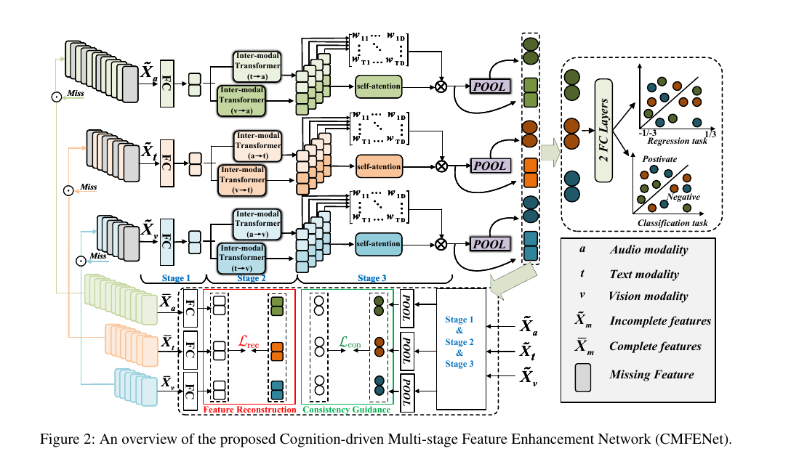
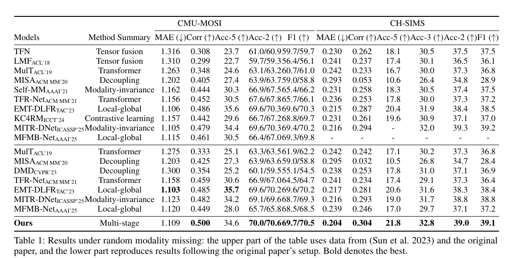
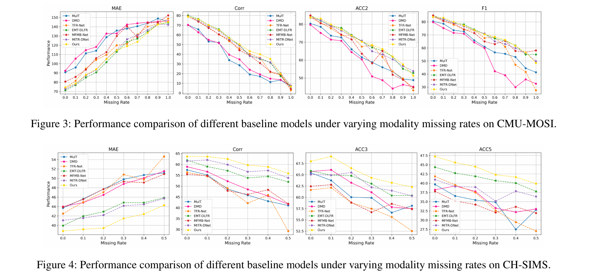

# CMFENet
> **CMFENet: A Cognition-driven Network with Multi-stage Feature Enhancement for Missing	Multimodal Sentiment Analysis**<br>
>The repository currently contains partial code relevant to the experimental setup. We are committed to releasing the full core codebase after paper acceptance or prior to the camera-ready deadline.


## Abstract



In recent years, Multimodal Sentiment Analysis (MSA) has become a research hotspot in artificial intelligence due to its wide applications in intelligent interaction scenarios. However, existing methods still face significant challenges in balancing modality-specific representation and cross-modal collaborative modeling, particularly under missing modality conditions where the model’s discriminative capacity and generalization ability are often severely compromised. Moreover, designing architecturally simple and computationally efficient models remains a critical open issue in this field. To address these challenges, this paper proposes a cognition-driven multi-stage feature enhancement network (CMFENet), inspired by human emotional cognition mechanisms, specifically designed for multimodal sentiment analysis under modality-missing scenarios. The proposed method employs a three-stage enhancement mechanism to improve both modality-specific discriminability and cross-modal collaboration. Additionally, It integrates a feature reconstruction strategy and a consistency guidance mechanism. These are designed to enhance the model's generalization capability under modality-missing scenarios, while maintaining a lightweight architecture. Experiments on benchmark datasets show that CMFENet consistently outperforms existing methods under various missing settings with high computational efficiency.  


## Prerequisites
* `Python 3.8`
* `PyTorch 1.7.1`
* `transformers==4.29.0`
* `einops==0.6.0`
* `scikit-learn=1.1.3`
* `pandas==1.5.1`
* `numpy=1.23.4`


## Data Preparation
- We conduct experiments on three popular MSA datasets, including [CMU-MOSI] and [CH-SIMS]

```
|MMSA
    |MOSI
        |Processed
            |unaligned_50.pkl (5da0b8440fc5a7c3a457859af27458beb993e088)
    |SIMS
        |Processed
            |unaligned_39.pkl (a00c73e92f66896403c09dbad63e242d5af756f8)
```


- For SIMS, you need to use the following script to generate the normalized version (only normalize audio and visual features).

```
python preprocess/normalize_sims.py
```

## Run
To comply with double-blind review policies, we are currently releasing only the code necessary to reproduce experiments on the SIMS dataset. The complete implementation and additional resources will be made publicly available after the review process.

- CMU-SIMS
```
sh scripts/sims/run_once.sh 0
```
'run_once.sh': for running across all missing rates (i.e., 0.0, 0.1, ..., 1.0).


## Results

- CMU-MOSI & CMU-MOSEI





